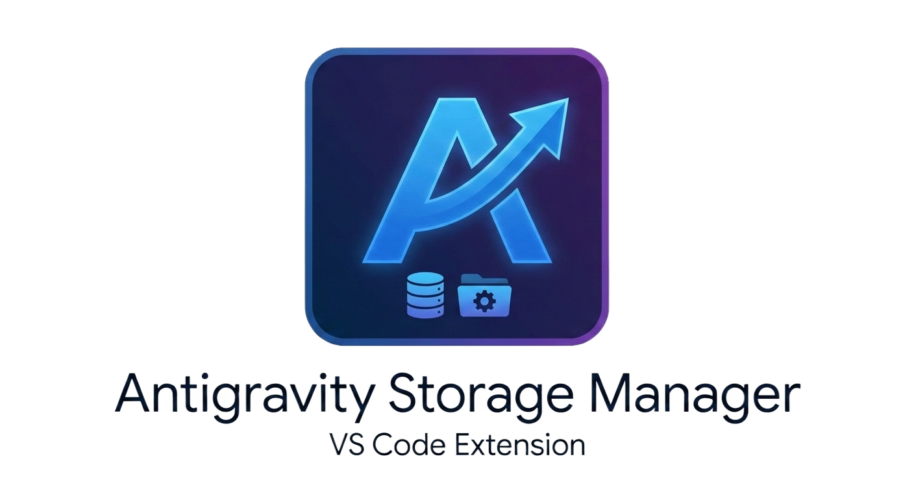
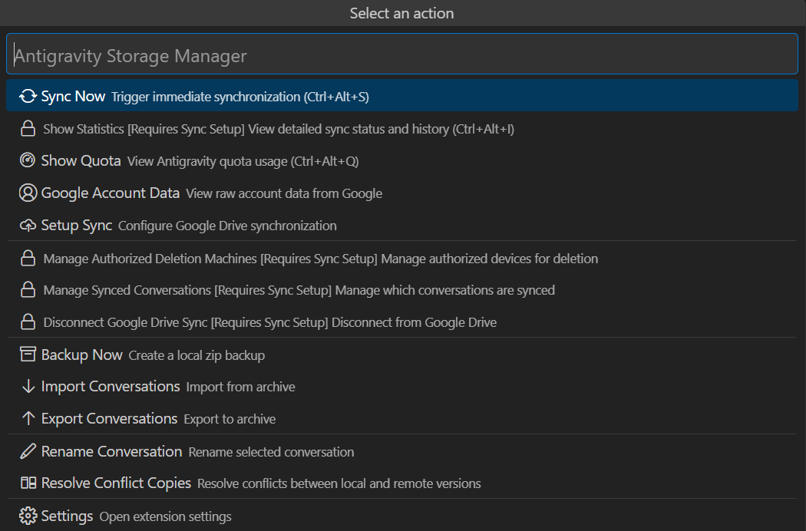
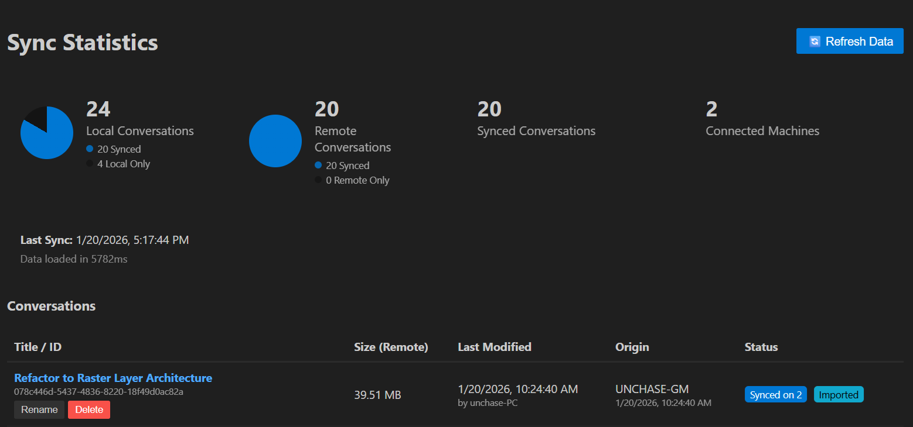
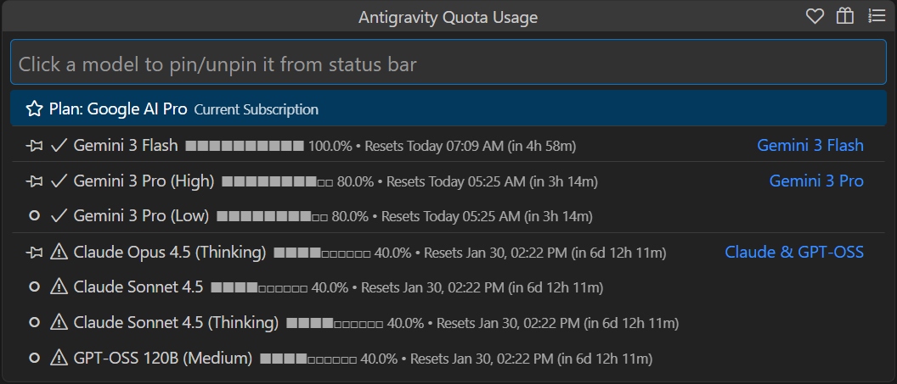
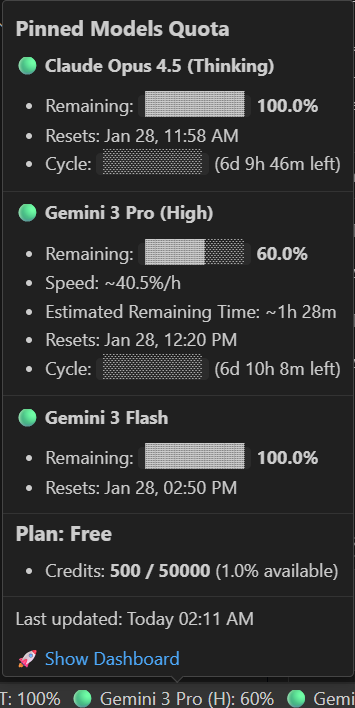
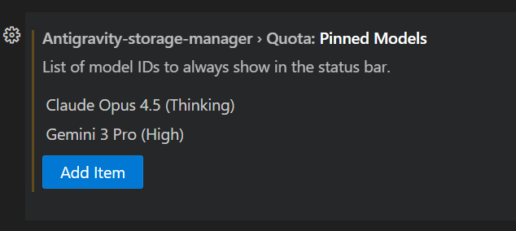
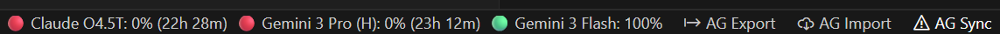
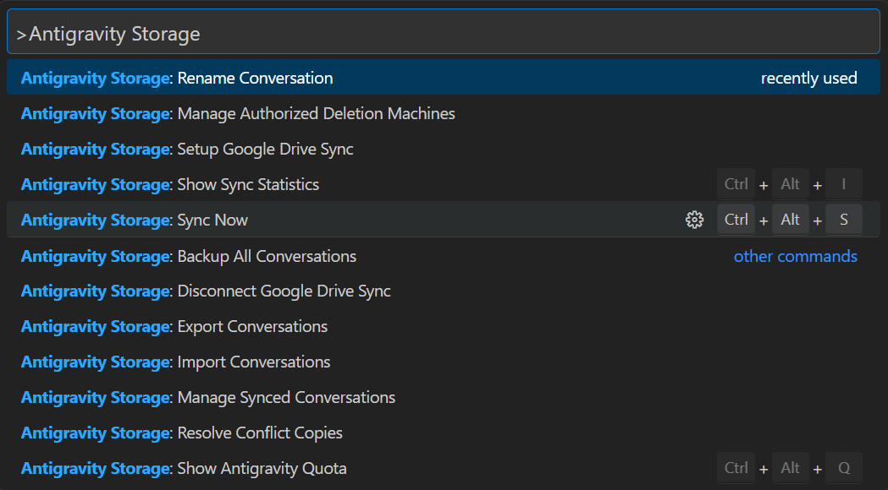
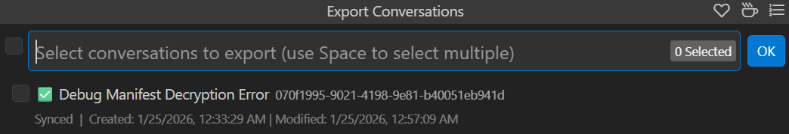

# Antigravity Storage Manager

  

  <strong>Securely sync Antigravity history with Google Drive. Parallel sync, quota monitoring, local backups, and advanced export/import tools.</strong> 

  
  
  
  
  

## Support

If you find this extension useful, consider supporting the development:

---

## Features

- ☁️ **Google Drive Sync** — Automatically sync conversations between devices with end-to-end encryption.
- ⚡ **Parallel Per-File Sync** — Fast differential sync with parallel processing and hash caching.
- 📦 **Export/Import** — Backup conversations to ZIP archives individually or in bulk with conflict detection.
- 📊 **Interactive Statistics** — Dashboard with sortable tables, visual analytics, and machine management.
- 🌍 **Global Localization** — Native support for **16 languages** (English, Russian, Chinese, Japanese, Korean, German, and more).
- 📉 **Advanced Quota Dashboard** — Real-time tracking with consumption speed, remaining time estimates, and visual progress bars.
- 🚦 **Smart Status Indicators** — Colored icons (🟢/🟡/🟠/🔴) and visual scales `[██░░]` to track quota and sync health at a glance.
- 🛑 **Cancellation Support** — Abort long-running operations (Sync, Export, Backup) safely at any time.
- 🛠️ **Smart Configuration** — Auto-detects missing sync setup and prompts for configuration on startup. Hot-reloads on language changes.
- 🎨 **Command Palette** — All commands available via `Ctrl+Shift+P`

---

## Google Drive Synchronization (New!)

Keep your conversations synchronized across multiple machines using your Google Drive.

### Setup Sync
1. Run command `Antigravity Storage: Setup Google Drive Sync`
2. **Create a Master Password**: This password is used to encrypt your data. You must use the same password on all machines.
3. **Authenticate**: Log in with your Google account.
4. **Done!** Conversations will automatically sync in the background.

👉 **[Detailed Setup Guide](SYNC_SETUP.md)**: Includes step-by-step instructions for configuring Google Cloud Console, adding test users, and troubleshooting.

### Security
- **Zero Knowledge**: All data is encrypted locally before being uploaded.
- **Master Password**: Only you know the password. It is stored securely in your OS keychain.
- **Limited Access**: The extension only accesses files it created (app-specific folder).

### Manual Sync
- Click the **AG Sync** button in the status bar
- Or run `Antigravity Storage: Sync Now`

### Manage Sync
- Click the **AG Sync** button in the status bar to open the menu.
- **Status Bar Tooltip**: Hover over "AG Sync" to see your Last Sync time and session Sync Count.
- **Sync Statistics**: Run `Antigravity Storage: Show Statistics` (or `Ctrl+Alt+I`) to view the interactive dashboard:
    - **Manage Conversations**: Rename or Delete conversations directly from the list.
    - **Selective Sync**: Manually **Upload** (Local Only) or **Download** (Remote Only) individual conversations.
    - **View Details**: Click on file sizes to see individual file breakdowns (scrollable). Hover over badges to see sync details.
    - **Visual Analytics**: Interactive pie charts showing sync coverage (Local vs Synced, Remote vs Synced).
    - **Machine Stats**: View "Uploads" and "Downloads" per machine, including total **data volume** (MB).
      - **Manage Machines**: Remove stale machines from the list using the **Delete (🗑️)** button.
      - **Force Sync**: Proactively push a sync signal to other machines with the **Push (🔄)** button (requires target machine to process signals).
    - **Real-time Data**: Use the **Refresh Data (🔄)** button to reload statistics immediately.
- **Status Bar**: The **AG Sync** icon updates dynamically (☁️ Cloud, 🔄 Spinning, ⚠️ Error, ✅ Check) to reflect the current state.
- **Shortcuts**: Default hotkeys are provided for common actions (e.g., `Ctrl+Alt+S` for Sync Now) and are displayed in the menu.

---

## Antigravity Quota Dashboard (New!)

*(Fig. 1: Quota Dashboard showing models sorted by Quota)*

Monitor your AI usage limits and remaining credits directly within VS Code.

### Features
- **Real-time Quota**: View your plan (Free/Pro/Ultra) status and remaining prompt credits.
- **Model Monitoring**: Pin specific models (e.g., Gemini 3 Pro, Claude Sonnet 4.5) to the status bar for quick access.
- **Visual Indicators**: ASCII progress bars show exactly how much quota is remaining.
- **Sorting**: Sort models by "Quota Remaining" or "Reset Time" to prioritize what's important.
- **Visual Scale**: Pro/Ultra models show a visual time scale `[████░░]` indicating time within the quota cycle.
- **Architecture Aware**: Works seamlessly on Windows, macOS (Intel/M1/M2), and Linux.

### Usage
1. Click the **AG Quota** (`AGQ`) indicator in the status bar (or run `Antigravity Quota: Show Quota`).
2. Pin/Unpin models by clicking on them in the menu.
3. The status bar auto-updates every minute.

### Status Bar & Settings

*(Fig. 2: Rich Tooltip)*

- Hover over the database icon in the status bar to see a rich tooltip with pinned model details.
- Configure which models to pin in your User Settings.

*(Fig. 3: Settings UI)*

---

## How It Works (Export/Import)

### 1. Quick Access via Status Bar
 
The extension adds **AG Export**, **AG Import**, and **AG Sync** buttons to your VS Code status bar:

### 2. Command Palette Integration

All commands are available through the Command Palette (`Ctrl+Shift+P`). Just type "Antigravity Storage" to see all available actions.

### 3. Multi-Select Export

When exporting, you can select **multiple conversations at once** using the Space key.

---

## Advanced Features

### 💾 Local Backup
Worried about the cloud? Create a full local backup anytime.
1. Run `Antigravity Storage: Backup All Conversations`
2. Choose a destination folder.
3. A single ZIP file containing **all** your conversations will be created.

### ⚔️ Conflict Resolution
If you edit the same conversation on two machines offline, a conflict copy is created.
1. Run `Antigravity Storage: Resolve Conflict Copies`
2. Select the conflicting conversation from the list.
3. Choose to **Keep Original** (delete copy) or **Keep Conflict** (overwrite original with copy).

---

## Installation

### From VS Code Marketplace
1. Open VS Code
2. Go to Extensions (`Ctrl+Shift+X`)
3. Search for "Antigravity Storage Manager"
4. Click Install

### Requirements
- VS Code 1.96.0 or higher
- Google Account (for synchronization)

## Data Location

Conversations are stored locally in:
- **Brain data:** `~/.gemini/antigravity/brain/`
- **Conversation files:** `~/.gemini/antigravity/conversations/`

Synced data is stored in your Google Drive in the `AntigravitySync` folder.

## Keyboard Shortcuts

The extension comes with default keybindings for common actions:
- `Ctrl+Alt+S` (Windows/Linux) / `Cmd+Alt+S` (Mac): **Sync Now**
- `Ctrl+Alt+I` (Windows/Linux) / `Cmd+Alt+I` (Mac): **Show Sync Statistics**

### Customizing Shortcuts
You can customize these shortcuts to fit your workflow:
1. Open **Keyboard Shortcuts** (`Ctrl+K Ctrl+S`).
2. Type `antigravity` in the search bar.
3. Right-click on any command (e.g., `Antigravity Storage: Import Conversations`) and select **Change Keybinding**.

## Contributing

See [CONTRIBUTING.md](CONTRIBUTING.md) for development setup and contribution guidelines.

## License

[MIT](LICENSE) © [unchase](https://github.com/unchase)
