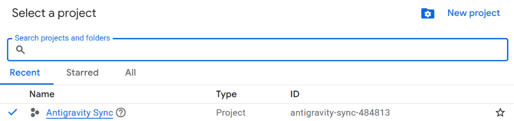
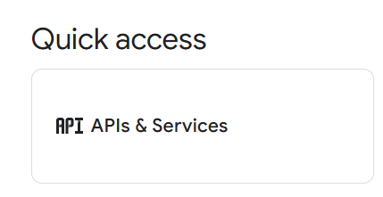
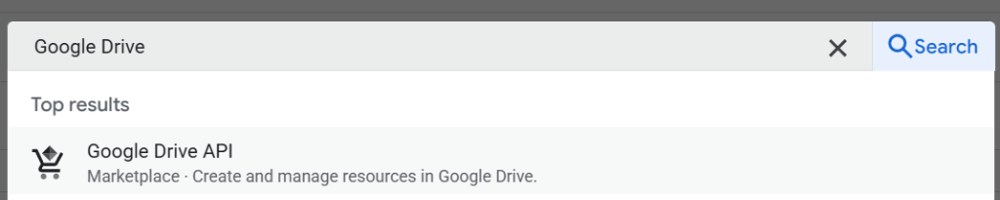
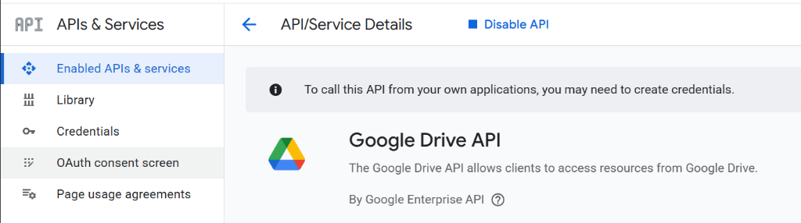
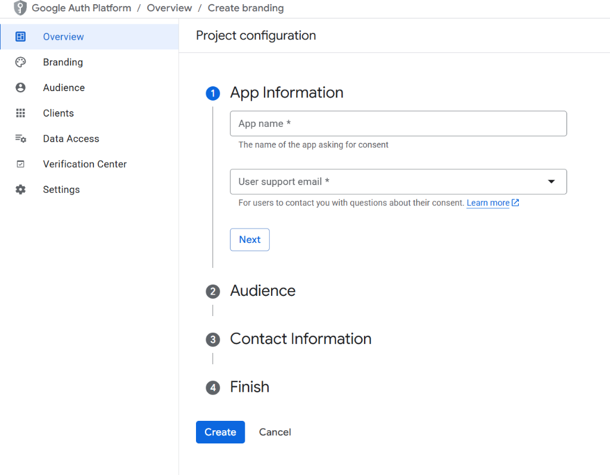
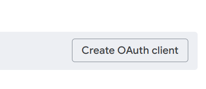
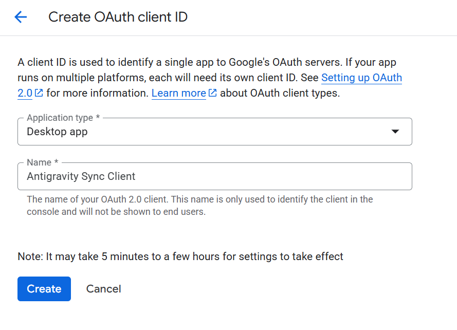
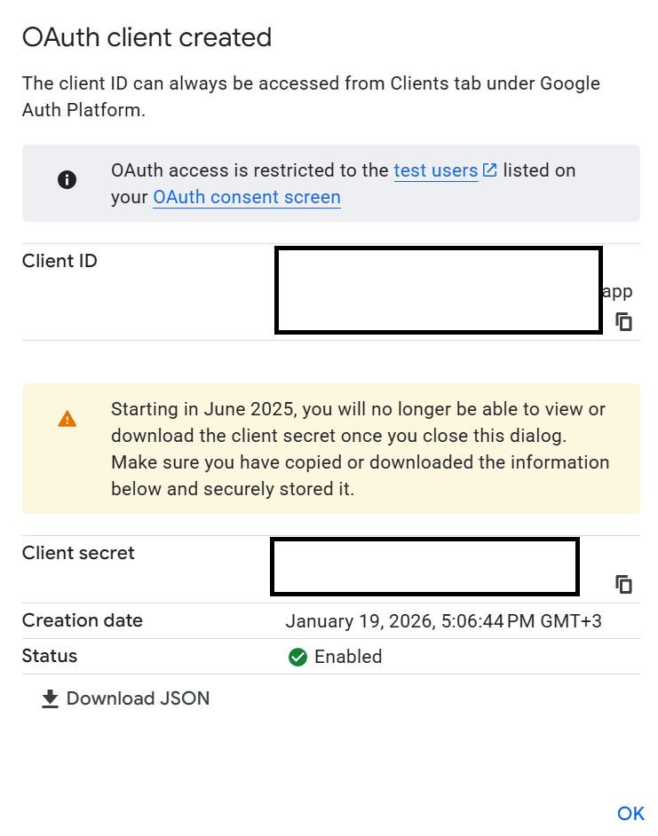

# Antigravity Synchronization Setup Guide

This guide describes how to set up and use the **Google Drive Synchronization** feature in Antigravity Storage Manager. This feature allows you to keep your AI conversation history synchronized across multiple computers (e.g., work and home) using your private Google Drive.

## Prerequisites

1. **VS Code** (version 1.96.0 or higher).
2. **Antigravity Storage Manager** extension installed (v0.3.0+).
3. A **Google Account** (Gmail) to store your data.

---

## Step 0: Google Cloud Configuration (Required)

Because this is a developer extension, you must provide your own Google OAuth2 credentials.

1. Go to the [Google Cloud Console](https://console.cloud.google.com/).
2. Create a **New Project** (e.g., "Antigravity Sync").

   

3. Go to **APIs & Services > Library**, search for **Google Drive API**, and **Enable** it.

    
   
   

4. Go to **APIs & Services > OAuth consent screen**:
   - Choose **External** (or Internal if you have a Workspace).
   - Fill in required fields (App name, email).
   - Add your email as a **Test User**.

   

5. Go to **APIs & Services > Credentials**:
   - Click **Create Credentials > OAuth client ID**.

     

   - Application type: **Desktop app**.
   - Name: "Antigravity Sync Client".
   - Click **Create**.

     

6. Copy your **Client ID** and **Client Secret**.

     

7. In VS Code:
   - Go to **Settings** (`Ctrl+,`).
   - Search for `Antigravity`.
   - Paste your **Client ID** and **Client Secret** into the respective fields.

---

## Step 1: Setting Up the First Machine

Start with the computer that has the conversations you want to sync.

1. **Open VS Code**.
2. Open the **Command Palette** (`Ctrl+Shift+P` or `Cmd+Shift+P` on Mac).
3. Type and run the command: `Antigravity Storage: Setup Google Drive Sync`.
4. **Create a Master Password**:
   - You will be asked to create a **Master Password**.
   - ⚠️ **Important:** Create a strong password and **remember it**. You will need this *exact* same password to set up your other computers.
   - This password is used to encrypt all your conversations before they are uploaded to Google Drive. Neither Google nor anyone else can read your data without it.
5. **Authenticate with Google**:
   - A browser window will open asking you to sign in to Google.
   - Authorize the application to access its specific folder in your Google Drive.
   - Once confirmed, close the browser window and return to VS Code.
6. **Initial Sync**:
   - The extension will automatically create a secure folder (`AntigravitySync`) in your Google Drive.
   - Your existing conversations will be encrypted and uploaded.
   - Check the status bar: you should see the **AG Sync** icon.

---

## Step 2: Setting Up Additional Machines

Now, set up synchronization on your second computer (e.g., your home laptop).

1. **Install the Extension** on the second computer.
2. Open the **Command Palette** and run: `Antigravity Storage: Setup Google Drive Sync`.
3. **Authenticate**: Sign in with the **same Google Account** you used on the first machine.
4. **Join Existing Sync**:
   - The extension will detect the existing `AntigravitySync` folder in your drive.
   - It will ask if you want to join the existing sync. Select **"Join Existing"**.
5. **Enter Master Password**:
   - Enter the **Master Password** you created in Step 1.
   - *Note: If you enter the wrong password, the extension won't be able to decrypt your data.*
6. **Done!**
   - The extension will download and decrypt conversations from your Drive.
   - New conversations created here will automatically sync to your first machine.

---

## How it Works

- **Auto-Sync**: By default, the extension checks for changes every **5 minutes**.
- **Manual Sync**: You can force a sync anytime by clicking the **AG Sync** button in the Status Bar or running `Antigravity Storage: Sync Now`.
- **Encryption**: All data (conversations and metadata) is encrypted with **AES-256-GCM** using your Master Password. Files on Google Drive look like `encrypted-blobs.zip.enc` and are unreadable without your password.

## Managing Conflicts

If you edit the same conversation on both computers while offline, a **Conflict** may occur when you reconnect. The extension will ask you how to resolve it:

- **Keep Local**: Overwrites the version in the cloud with your current local version.
- **Keep Remote**: Discards your local changes and accepts the version from the cloud.
- **Keep Both**: Keeps both versions (renaming one with a `-conflict` suffix) so you don't lose any data.

## Troubleshooting

### "Incorrect Password" Error
If you see this on a new machine, it means the password you entered doesn't match the one used to encrypt the data.
- Run `Antigravity Storage: Disconnect Google Drive Sync`.
- Run setup again and enter the correct password.

### Resetting Everything
If you lost your Master Password or want to start over:
1. **Disconnect** the extension on all machines (`Antigravity Storage: Disconnect Google Drive Sync`).
2. Go to your **Google Drive** (in a web browser).
3. Delete the folder named `AntigravitySync`.
4. Run setup again on your main machine to check create a new sync store with a new password.
